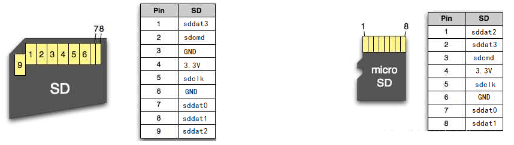

-CAD09D.svg)   

中文 | [English](#en)

FPGA SDcard File Reader
===========================

基于 FPGA 的 SD卡文件读取器

* **功能** ：FPGA作为 **SD-host** ， 指定文件名读取文件内容；或指定扇区号读取扇区内容。
* **性能** ：使用 SD总线，而不是 SPI总线。读取速度更快。
* **兼容性强** ：自动适配 **SD卡版本** ，自动适配 **FAT16/FAT32文件系统**。
* 纯 RTL 实现，便于移植和仿真。

|                      |  SDv1.1 card       |  SDv2 card          | SDHCv2 card        |
| :-----               | :------------:     |   :------------:    | :------------:     |
| **读取扇区**         | :heavy_check_mark: |  :heavy_check_mark: | :heavy_check_mark: |
| **读取文件 (FAT16)** | :heavy_check_mark: |  :heavy_check_mark: | :heavy_check_mark: |
| **读取文件 (FAT32)** | :heavy_check_mark: |  :heavy_check_mark: | :heavy_check_mark: |


# 背景知识

## SD总线

SD卡使用 SD 总线与 SD-host （比如读卡器）连接，SD总线的信号包括：

| 信号名                         | 输入输出方向                                     |
| ------------------------------ | ------------------------------------------------ |
| sdclk                          | host→ card                                       |
| sdcmd                          | 当发起命令时 host→ card ，当响应命令时 card→host |
| sddat0、sddat1、sddat2、sddat3 | 当写数据时 host→card ，当读数据时 card→host      |

这些信号在 SD 卡和 microSD 卡上的引脚定义如下图（SD卡和microSD卡除了外形尺寸外，功能上没有差别）

|                     |
| :------------------------------------------: |
| 图：SD 卡（左）与 microSD 卡（右）的引脚定义 |


## 文件系统

SD卡本身只是一大块线性的数据存储空间，分为多个扇区 (sector)，每个扇区 512 字节，扇区0的地址范围为 0x00000000\~0x000001FF，扇区1的地址范围为 0x00000200\~0x000003FF，以此类推……。底层的读取和写入操作都以扇区为单位。为了在这片线性的存储空间中组织磁盘分区和文件，人们规定了复杂的数据结构——文件系统，SD卡最常用的文件系统是 FAT16 和 FAT32 。

为了从 SD 卡中读取文件数据，本库分为两个功能模块：

- 按照 SD 总线标准操控 SD 总线，指定扇区号，读取扇区。
- 在能够读取扇区的基础上，解析文件系统，也就是给定文件名，找到文件所在的位置和长度。实际上，文件可能不是连续存储的（被拆成多块放在不同扇区），本库会正确地处理这种情况。


# 如何调用本模块

RTL 文件夹中的 sd_file_reader.sv 是 SD卡文件读取器的顶层模块，它的定义如下：

```
module sd_file_reader #(
    parameter FILE_NAME = "example.txt",
    parameter [2:0] CLK_DIV = 3'd1,
    parameter       SIMULATE = 0
)(
    // rstn active-low, 1:working, 0:reset
    input  wire       rstn,
    // clock
    input  wire       clk,
    // SDcard signals (connect to SDcard), this design do not use sddat1~sddat3.
    output wire       sdclk,
    inout             sdcmd,
    input  wire       sddat0,            // FPGA only read SDDAT signal but never drive it
    // status output (optional for user)
    output wire [3:0] card_stat,         // show the sdcard initialize status
    output wire [1:0] card_type,         // 0=UNKNOWN    , 1=SDv1    , 2=SDv2  , 3=SDHCv2
    output wire [1:0] filesystem_type,   // 0=UNASSIGNED , 1=UNKNOWN , 2=FAT16 , 3=FAT32 
    output reg        file_found,        // 0=file not found, 1=file found
    // file content data output (sync with clk)
    output reg        outen,             // when outen=1, a byte of file content is read out from outbyte
    output reg  [7:0] outbyte            // a byte of file content
);
```

其中：

- `FILE_NAME` 指定要读的目标文件名。
- `CLK_DIV` 是时钟分频系数，它的取值需要根据你提供的 clk 时钟频率来决定（详见代码注释）。
- `SIMULATE` 是仿真加速选项。**平常要设为 `0` **。只有仿真时才可以设 为 `1` 来加速 SD 卡初始化进度，防止仿真占用过多时间。
- `clk` 是模块驱动时钟。
- `rstn` 是复位信号，在开始工作前需要令 `rstn=0` 复位一下，然后令 `rstn=1` 释放。
- `sdclk` 、 `sdcmd` 、 `sddat0` 是 SD 总线信号，需要连接到 SD 卡。
    - 注意到本模块只用到了 `sddat0` 而没用到 `sddat1~sddat3` ，因为 SD 卡上电会默认运行在 1bit 窄数据总线模式，可以用命令切换到 4bit 宽数据总线模式，我没有做切换，一直只用 `sddat0` 。而  `sddat1~sddat3`  需要弱上拉或强上拉到高电平（避免 SD 卡进入 SPI 总线模式）。
- `card_type` 指示检测到的 SD 卡的类型：0对应未知、1对应SDv1、2对应SDv2、3对应SDHCv2。
- `file_system_type` 指示检测到的 SD 卡的文件系统：1对应未知、2对应FAT16、3对应FAT32。
- `file_found` 指示是否找到目标文件：0代表未找到，1代表找到。
- 如果找到目标文件，模块会逐个输出目标文件中的所有字节，每输出一个字节，`outen` 上就产生一个高电平脉冲，同时该字节出现在 `outbyte` 上。

> **注意**：本库只使用了 sddat0 ，而不使用 sddat1\~3 （也即SD 1-bit总线模式）。在工作时需要将 sddat1\~3 持续拉高（可以在 FPGA 代码里 `assign sddat[3:1] = 3'b111;` ，或者在PCB板上使用上拉电阻），这样 SD 卡才能正常进入 SD 总线模式，否则会进入 SPI 总线模式。


# 仿真

仿真相关的文件都在 SIM 文件夹中，其中：

- sd_fake.sv ：是一个 FPGA 模拟 SD 卡的代码，它模拟了一个具有 FAT32 系统，里面有一个 example.txt 文件的 SD 卡。它来自我的另一个库：[FPGA-SDfake](https://github.com/WangXuan95/FPGA-SDfake) 
- tb_sd_file_reader.sv 是仿真顶层，它会调用 sd_file_reader 读取 sd_fake 中的 example.txt 。
- tb_sd_file_reader_run_iverilog.bat 是运行 iverilog 仿真的脚本。

使用 iverilog 进行仿真前，需要安装 iverilog ，见：[iverilog_usage](https://github.com/WangXuan95/WangXuan95/blob/main/iverilog_usage/iverilog_usage.md)

然后双击 tb_sd_file_reader_run_iverilog.bat 运行仿真，会运行大约几分钟。

仿真运行完后，可以打开生成的 dump.vcd 文件查看波形。


读取文件示例
===========================

example-vivado-readfile 文件夹中包含一个 vivado 工程，它运行在 [Nexys4开发板](http://www.digilent.com.cn/products/product-nexys-4-ddr-artix-7-fpga-trainer-board.html) 上（Nexys4 开发板有 microSD 卡槽，比较方便）。它会从 SD卡根目录中找到文件 example.txt 并读取其全部内容，然后用 **UART** 发送出给PC机。

按以下步骤运行该示例：

1. 准备一张 **microSD卡** 。如果是标准尺寸的SD卡（大SD卡），可以用大卡转 microSD 卡的转接板转接一下。
1. 确保卡中的文件系统是  **FAT16** 或 **FAT32**  。如果不是，则需要格式化一下。
2. 在根目录下创建 **example.txt** (文件名大小写不限) ， 在文件中随便写入一些内容。
3. 将卡插入 Nexys4 的卡槽。
4. 将 Nexys4 的USB口插在PC机上，用 **串口助手** 或 **Putty** 等软件打开对应的串口。
5. 用 vivado 打开目录 example-vivado-readfile 中的工程，综合并烧录。
6. 观察到串口打印出文件内容。
7. 同时，还能看到 Nexys4 上的 LED 灯发生变化，它们指示了SD卡的类型和状态，具体含义见代码。
8. 按下 Nexys4 上的红色 CPU_RESET 按钮可以重新读取，再次打印出文件内容。


读取扇区示例
===========================

example-vivado-readsector 文件夹中包含一个 vivado 工程，它运行在 [Nexys4开发板](http://www.digilent.com.cn/products/product-nexys-4-ddr-artix-7-fpga-trainer-board.html) 上。它会从 SD卡中读取扇区0（它在文件系统中往往叫 MBR 扇区），然后用 **UART** 发送出给PC机。

按以下步骤运行该示例：

1. 准备一张 **microSD卡** 。如果是标准尺寸的SD卡（大SD卡），可以用大卡转 microSD 卡的转接板转接一下。
2. 将 Nexys4 的USB口插在PC机上，用 **串口助手** 打开对应的串口，请选择 “HEX接收” ，以十六进制的形式打印每个字节，这样我们才能看到那些 ASCII 不可打印字符。
3. 用 vivado 打开目录 example-vivado-readsector 中的工程，综合并烧录。
4. 观察到串口打印出扇区0的内容。
5. 同时，还能看到 Nexys4 上的 LED 灯发生变化，它们指示了SD卡的类型和状态，具体含义见代码注释。
6. 按下 Nexys4 上的红色 CPU_RESET 按钮可以重新读取，再次打印出扇区内容。


<span id="en">FPGA SDcard File Reader</span>
===========================

FPGA-based SDcard file reader

* **Function**: FPGA acts as **SD-host**, specifying the file name to read the file content; or specifying the sector number to read the sector content.
* **Performance**: Use SD bus instead of SPI bus. Read faster.
* **Strong compatibility**: automatically adapt to **SDcard version**, automatically adapt to **FAT16/FAT32 file system**.
* pure RTL implement, easy to simulate and transplant.

|                       |    SDv1.1 card     |     SDv2 card      |    SDHCv2 card     |
| :-------------------- | :----------------: | :----------------: | :----------------: |
| **Read Sector**       | :heavy_check_mark: | :heavy_check_mark: | :heavy_check_mark: |
| **Read File (FAT16)** | :heavy_check_mark: | :heavy_check_mark: | :heavy_check_mark: |
| **Read File (FAT32)** | :heavy_check_mark: | :heavy_check_mark: | :heavy_check_mark: |


# Background

## SD bus

The SDcard is connected to the SD-host (such as a card adaptor) using the SD bus. The signals of the SD bus include:

| Signal name                    | Direction                                                    |
| ------------------------------ | ------------------------------------------------------------ |
| sdclk                          | host→card                                                    |
| sdcmd                          | host→card when request command, card→host when respond command |
| sddat0, sddat1, sddat2, sddat3 | host→card, when write data, card→host when read data         |

The pin definitions of these signals on SDcard and microSDcard are as follows (SDcard and microSDcard have no difference in function except for the shape and appearance).

|                                     |
| :----------------------------------------------------------: |
| Figure : pin defination of SDcard (left) and microSDcard (right) |

## File System

The SDcard is just a large linear data storage space, divided into multiple sectors, each sector contains 512 bytes, the address range of sector 0 is 0x00000000\~0x000001FF, and the address range of sector 1 is 0x00000200\~0x000003FF, and so on…. The underlying read and write operations are performed in unit of sectors. In order to organize disk partitions and files in this linear storage space, people stipulate complex data structures: file system. The most commonly used file systems for SDcard are FAT16 and FAT32.

In order to read file data from SDcard, this library is divided into two functional modules:

- Manipulate the SD bus according to the SD bus standard, specify the sector number and read the sector.
- On the basis of being able to read sectors, parse the file system, that is, given the file name, to find the location and length of the file. In fact, the file may not be stored contiguously (that is, split into multiple blocks in different sectors), my code will handle this case correctly.


# How to use this module

sd_file_reader.sv in the [RTL](./RTL) folder is the top-level module of the SD card file reader, and it is defined as follows:

```
module sd_file_reader #(
    parameter FILE_NAME = "example.txt",
    parameter [2:0] CLK_DIV = 3'd1,
    parameter       SIMULATE = 0
)(
    // rstn active-low, 1:working, 0:reset
    input  wire       rstn,
    // clock
    input  wire       clk,
    // SDcard signals (connect to SDcard), this design do not use sddat1~sddat3.
    output wire       sdclk,
    inout             sdcmd,
    input  wire       sddat0,            // FPGA only read SDDAT signal but never drive it
    // status output (optional for user)
    output wire [3:0] card_stat,         // show the sdcard initialize status
    output wire [1:0] card_type,         // 0=UNKNOWN    , 1=SDv1    , 2=SDv2  , 3=SDHCv2
    output wire [1:0] filesystem_type,   // 0=UNASSIGNED , 1=UNKNOWN , 2=FAT16 , 3=FAT32 
    output reg        file_found,        // 0=file not found, 1=file found
    // file content data output (sync with clk)
    output reg        outen,             // when outen=1, a byte of file content is read out from outbyte
    output reg  [7:0] outbyte            // a byte of file content
);
```

where:

- `FILE_NAME` specifies the name of the target file to read.
- `CLK_DIV` is the clock frequency division factor, its value needs to be determined according to the `clk` frequency you provide (see code comments for details).
- `SIMULATE` is the simulation speed-up option. **Usually set to `0`**. It can be set to `1` only during simulation to speed up the SD card initialization progress and prevent the simulation from taking too much time.
- `clk` is the module driving clock.
- `rstn` is the reset signal, you need to set `rstn=0` before starting to work, and then set `rstn=1` to release it.
- `sdclk` , `sdcmd` , `sddat0` are SD bus signals, should connect to SDcard.
  - Note that this module only uses `sddat0` and does not use `sddat1~sddat3`, because the SDcard will run in 1bit narrow data bus mode by default when powered on, and can be switched to 4bit wide data bus mode with the command, I did not switch it, always use only `sddat0`. And `sddat1~sddat3` can be left unconnected.
- `card_type` will output the detected SDcard type: 0 corresponds to unknown, 1 corresponds to SDv1, 2 corresponds to SDv2, 3 corresponds to SDHCv2.
- `file_system_type` will output the detected file system of SDcard: 1 corresponds to unknown, 2 corresponds to FAT16, 3 corresponds to FAT32.
- `file_found` will output whether the target file was found: 0 means not found, 1 means found.
- If the target file is found, the module will output all the bytes in the file. For each output byte, a high-level pulse will be generated on `outen`, and the byte will appear on `outbyte`.

> **Note**: This repo only uses sddat0 (i.e. SD 1-bit bus mode) instead of sddat1\~3. When working, you need to continuously pull sddat1\~3 high (you can write `assign sddat[3:1] = 3'b111;` in the FPGA code, or use pull-up resistors on the PCB). This is to ensure that the SD card can enter SD bus mode normally, otherwise it will enter SPI bus mode.


# RTL Simulation

Simulation related files are in the [SIM](./SIM) folder, where:

- sd_fake.sv is a code for FPGA to imitate an SDcard. In this simulation program, it imitates an SDcard with FAT32 system and has an file example.txt inside. It comes from another repository of mine: [FPGA-SDfake](https://github.com/WangXuan95/FPGA-SDfake)
- tb_sd_file_reader.sv is the top level of the simulation, it will call sd_file_reader.sv to read the file in sd_fake.sv .
- tb_sd_file_reader_run_iverilog.bat is a command script to run iverilog simulations.

Before simulate using iverilog, you need to install iverilog , see: [iverilog_usage](https://github.com/WangXuan95/WangXuan95/blob/main/iverilog_usage/iverilog_usage.md)

Then double-click tb_sd_file_reader_run_iverilog.bat to run simulation, which will run for several minutes.

After the simulation runs, you can open the generated dump.vcd file to view the waveform.


FPGA Demo: Read File
===========================

The [example-vivado-readfile](./example-vivado-readfile) folder contains a vivado project, which runs on the [Nexys4 development board](http://www.digilent.com.cn/products/product-nexys-4-ddr-artix-7-fpga- trainer-board.html) (it has a microSDcard slot,). It will find the file example.txt from the root directory of the SDcard and read its entire content, and then send it to PC via **UART**.

Run the demo as follows:

1. Prepare a **microSDcard** of **FAT16** or **FAT32**. If it is not **FAT16** or **FAT32**, you need to format it.
2. Create **example.txt** in the root directory (the file name is not limited in case), and write some content in the file.
3. Insert the SDcard into the card slot of Nexys4.
4. Plug the USB port of Nexys4 into PC, and open the corresponding serial port with software such as **Serial Assistant**, **Putty**, **HyperTerminal** or **minicom**.
5. Open the project in the directory [example-vivado-readfile](./example-vivado-readfile) with vivado, synthesize and program it.
6. Observe that the serial port prints the contents of the file.
7. Simutinously, you can see that the LEDs on the Nexys4 change, they indicate the type and status of the SDcard, see the code for the specific meaning.
8. Press the red CPU\_RESET button on Nexys4 to re-read and print out the file content again.


FPGA Demo: Read Sector
===========================

The [example-vivado-readsector](./example-vivado-readsector) folder contains a vivado project, which runs on the [Nexys4 development board](http://www.digilent.com.cn/products/product-nexys-4-ddr-artix-7-fpga- trainer-board.html), it will read sector 0 from the SD card (it is often called the MBR sector in file systems) and send it to PC via **UART**.

Run the demo as follows:

1. Prepare a **microSDcard**. Plug it into the card slot of Nexys4.
2. Plug the USB port of Nexys4 into PC, use **Serial Assistant** to open the corresponding serial port, please select "HEX Receive Mode", print each byte in hexadecimal form, so that we can see those ASCII non-printable characters.
3. Use vivado to open the project in the directory [example-vivado-readsector](./example-vivado-readsector) , synthesize and program it.
4. Observe that the serial port prints the contents of sector 0.
5. At the same time, you can also see that the LEDs on the Nexys4 change, they indicate the type and status of the SDcard, see the code comments for the specific meaning.
6. Press the red CPU\_RESET button on Nexys4 to re-read and print out the sector content again.

